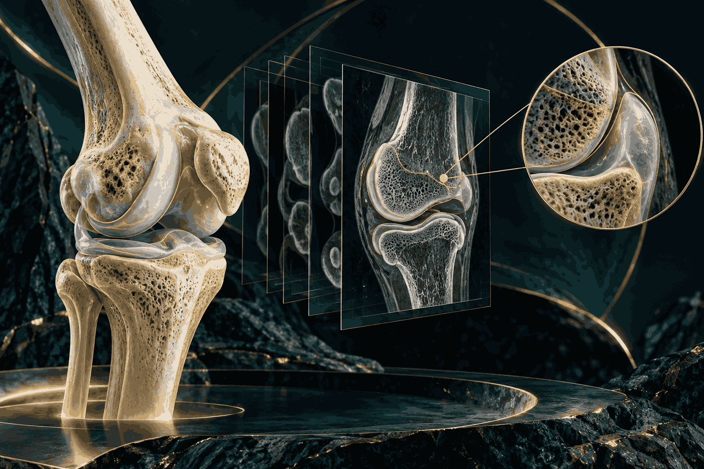
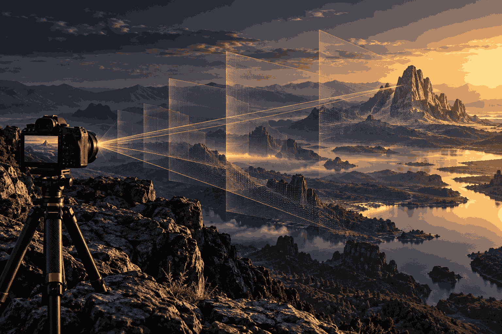

<h1 align="center">فاطمه غیاثی | نمونه‌کارهای هوش مصنوعی و بینایی ماشین</h1>

<strong>پژوهشگر و توسعه‌دهندهٔ هوش مصنوعی، بینایی ماشین و علوم داده</strong>

  <a href="#نمونهکارها">نمونه‌کارها</a> ·
  <a href="#توانمندیها">توانمندی‌های من</a> ·
  <a href="#رویکرد">رویکرد من</a>

  
  
  

---

<h2 id="درباره" dir="rtl" align="right">دربارهٔ من</h2>

من <strong>فاطمه غیاثی</strong> هستم و به پژوهش و توسعه در هوش مصنوعی، بینایی ماشین و تحلیل داده علاقه‌مندم. در کارهایم از مسئله‌های تصویری و داده‌محور شروع می‌کنم و به مسیرهایی روشن و قابل بازبینی فکر می‌کنم؛ از جمله تحلیل تصاویر پزشکی، بررسی آسیب‌های استخوانی، یادگیری عمیق و ساخت ابزارهای کاربردی برای کمک به تحلیل و بازبینی انسانی.

این صفحه مجموعه‌ای از زمینه‌های کاری و نمونه‌مسئله‌های مورد علاقهٔ من است. توضیحات پروژه‌ها مسیر و چارچوب فنی پیشنهادی را شرح می‌دهند و ادعای پیاده‌سازی کامل، عملکرد سنجیده‌شده یا نتیجهٔ بالینی نیستند. نشان وارنا در بالای صفحه صرفاً عنصر بصریِ زمینهٔ این نمونه‌هاست و بیانگر مالکیت یا هویت یک تیم نیست.

<h2 id="نمونهکارها" dir="rtl" align="right">نمونه‌کارهای من | از تصویر تا تحلیل</h2>

<table dir="rtl" align="right">
<tr>
<td width="50%" valign="top" align="right">
<h3>تحلیل آسیب‌های استخوانی در تصاویر ایکس‌ری</h3>

<strong>هدف</strong> بررسی یک مسیر تصویری برای کمک به شناسایی نشانه‌های احتمالی آسیب استخوانی و فراهم‌کردن خروجی قابل بازبینی برای کاربر انسانی.

<strong>چالش‌ها</strong> تفاوت کیفیت و کنتراست اسکن‌ها، ظرافت ساختار استخوان و شباهت نواحی طبیعی و مشکوک، تحلیل را دشوار می‌کند. کاهش نویز و در عین حال حفظ جزئیات مهم، همراه با نمایش روشن نواحی مورد توجه، از چالش‌های اصلی است.

<strong>مسیر فنی</strong> کنترل کیفیت تصویر ← پیش‌پردازش و تنظیم نمایش ← بررسی روش‌های ناحیه‌بندی یا استخراج ویژگی و یادگیری عمیق ← بصری‌سازی نتایج برای بازبینی انسانی.

نمونه‌مسئلهٔ مفهومی · ابزارهای مرتبط: <code dir="ltr">Python</code>، <code dir="ltr">OpenCV</code>، <code dir="ltr">NumPy</code>

</td>
<td width="50%" valign="top" align="right">
<h3>تخمین فاصلهٔ دوربین تا شیء</h3>

<strong>هدف</strong> بررسی روشی برای برآورد فاصلهٔ دوربین تا یک شیء با استفاده از نشانه‌های تصویری و روابط هندسی.

<strong>چالش‌های هندسی</strong> ابهام مقیاس، تغییر زاویه و پرسپکتیو، کالیبراسیون دوربین و کوچک‌شدن هدف در فاصله‌های بیشتر بر برآورد اثر می‌گذارند. لرزش و کیفیت مشاهده نیز می‌توانند عدم‌قطعیت را افزایش دهند.

<strong>مسیر فنی</strong> تعیین یا تشخیص هدف ← استخراج نشانه‌های هندسی ← استفاده از پارامترهای دوربین و فرض‌های مقیاس برای تخمین فاصله ← بررسی خطا و بصری‌سازی نتیجه.

نمونه‌مسئلهٔ مفهومی · ابزارهای مرتبط: <code dir="ltr">Python</code>، <code dir="ltr">OpenCV</code>، <code dir="ltr">MATLAB</code>

</td>
</tr>
</table>

 

<h2 id="توانمندیها" dir="rtl" align="right">توانمندی‌ها و علایق فنی من</h2>

این فهرست حوزه‌های فنی‌ای را نشان می‌دهد که به آن‌ها می‌پردازم یا در چارچوب نمونه‌مسئله‌ها دنبال می‌کنم؛ شرح آن‌ها ادعای سابقهٔ شغلی یا تسلط تأییدشده نیست.

<table dir="rtl" align="right">
<thead><tr><th align="right">حوزه</th><th align="right">مهارت‌ها و قابلیت‌های مورد توجه</th></tr></thead>
<tbody>
<tr><td><strong>تصویر پزشکی و یادگیری عمیق</strong></td><td>شناخت کیفیت و قالب تصویر · تنظیم شدت و کنتراست · پیش‌پردازش و کاهش نویز · ناحیه‌بندی · استخراج ویژگی · افزایش داده · آشنایی با مسیرهای یادگیری عمیق · توجه به عدم‌توازن داده · تقسیم داده و پیشگیری از نشت · تحلیل خطا · ارزیابی حساسیت · بصری‌سازی نتایج · طراحی ابزار بازبینی</td></tr>
<tr><td><strong>بینایی ماشین و هندسه</strong></td><td>هندسهٔ دوربین · کالیبراسیون · تحلیل مقیاس و پرسپکتیو · تشخیص یا تعیین هدف · استخراج نشانه‌های هندسی · برازش پارامتر · بهینه‌سازی عددی · توجه به لرزش · پالایش زمانی · تحلیل عدم‌قطعیت · شناسایی دادهٔ پرت · ارزیابی تخمین فاصله · بصری‌سازی عمق · طراحی مسیر یکپارچه‌سازی ماژول</td></tr>
<tr><td><strong>ابزارهای مرتبط</strong></td><td><code dir="ltr">Python</code> · <code dir="ltr">OpenCV</code> · <code dir="ltr">NumPy</code> · <code dir="ltr">MATLAB</code></td></tr>
</tbody>
</table>

 

<h2 id="رویکرد" dir="rtl" align="right">رویکرد من</h2>

<ul dir="rtl" align="right">
<li><strong>شناخت داده پیش از انتخاب روش:</strong> کیفیت ورودی، محدودیت‌ها و فرض‌ها را در نظر می‌گیرم.</li>
<li><strong>نتایج قابل بازبینی:</strong> برای من مهم است که خروجی تا جای ممکن روشن و قابل ارزیابی باشد.</li>
<li><strong>توجه به خطا و عدم‌قطعیت:</strong> محدودیت‌ها و موارد دشوار باید بخشی از تحلیل باشند.</li>
<li><strong>ابزار در خدمت انسان:</strong> ابزارهای محاسباتی را کمک‌تحلیل می‌دانم، نه جایگزین قضاوت متخصص.</li>
</ul>

<blockquote dir="rtl" align="right">
<strong>اگر میخواهید از مدل‌ پزشکی من استفاده کنید:</strong> ایدهٔ تحلیل سی‌تی‌اسکن در این مخزن آموزشی/مفهومی است و ابزار تشخیص یا توصیهٔ درمانی محسوب نمی‌شود. هر کاربرد بالینی به داده و اعتبارسنجی مناسب، ارزیابی متخصصان و رعایت الزامات قانونی مربوط نیاز دارد.
</blockquote>

